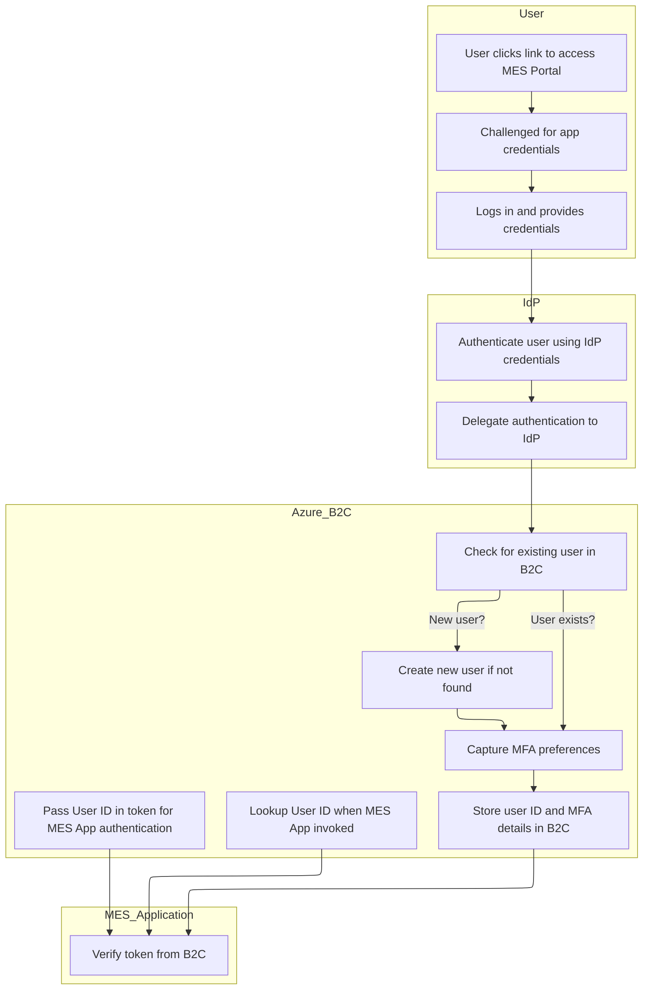
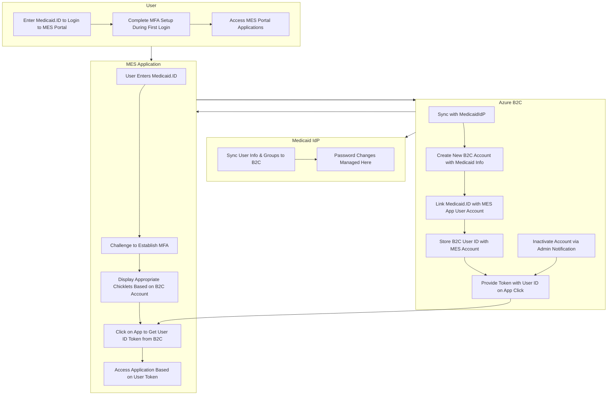
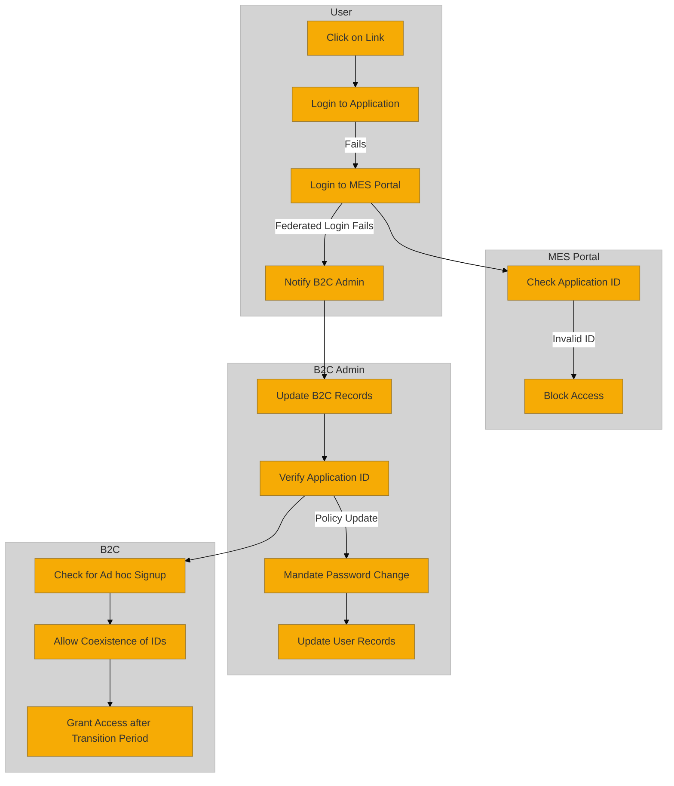

### Table: Pros and Cons Option 2

### 1. **Implementation**

| **Pros**                                                                                                                                                     | **Cons**                                                                                                                                                     |
|---------------------------------------------------------------------------------------------------------------------------------------------------------------|-------------------------------------------------------------------------------------------------------------------------------------------------------------|
| - **Streamlined Setup**: AD sync between Medicaid and Entra ID ensures user data is pre-loaded, reducing friction during the go-live phase.                   | - **Complex Initial Configuration**: Establishing the AD sync between Medicaid and Entra ID can be complex, requiring thorough planning and testing.          |
| - **Time-Saving**: Data is ready ahead of time, so users don’t need to complete one-time challenges for linking, saving significant time during implementation. | - **Initial Development Cost**: The development and configuration of AD synchronization and mapping processes will incur upfront costs, including testing and validation. |
| - **Avoids User Linking Issues**: By performing the data extraction and mapping during initial setup, the system minimizes potential errors in user identity linkage. | - **Potential for Data Mismatch**: Inaccurate or incomplete data mapping during the initial phase may cause issues that are harder to resolve later.           |

### 2. **Integration**

| **Pros**                                                                                                                                                     | **Cons**                                                                                                                                                     |
|---------------------------------------------------------------------------------------------------------------------------------------------------------------|-------------------------------------------------------------------------------------------------------------------------------------------------------------|
| - **Seamless Integration**: AD sync ensures that Medicaid user data is automatically available in Entra ID, enabling seamless integration across MES modules.   | - **Legacy System Compatibility**: Depending on Medicaid’s AD structure, some legacy components may require additional configuration for full compatibility with Entra ID. |
| - **Consistent Data Management**: By syncing AD data, all user attributes, roles, and permissions are consistently propagated across all integrated systems.    | - **Dependency on Medicaid Systems**: The success of the integration depends on Medicaid's ability to sync data correctly with Entra ID. Any delays could impact portal access. |

### 3. **Maintenance**

| **Pros**                                                                                                                                                     | **Cons**                                                                                                                                                     |
|---------------------------------------------------------------------------------------------------------------------------------------------------------------|-------------------------------------------------------------------------------------------------------------------------------------------------------------|
| - **Reduced Ongoing Effort**: Once AD sync is set up, maintenance is reduced, as data automatically flows from Medicaid to Entra ID without manual intervention. | - **Ongoing Sync Monitoring**: Continuous monitoring of the synchronization process is required to ensure data consistency and accuracy over time.            |
| - **Automated Updates**: Future changes in Medicaid user data (e.g., role changes or new users) are automatically reflected in Entra ID, reducing manual updates. | - **Risk of Sync Failures**: Any failure in the AD sync could lead to discrepancies in user data, resulting in incorrect user access permissions.            |
| - **Fewer Access Issues**: Automated data mapping reduces the likelihood of access issues due to missing or incorrect user identity links.                      | - **Complex Debugging**: If sync issues arise, debugging and resolving them could be complex, especially if there are many systems interacting with Entra ID. |

### 4. **Customer Impact**

| **Pros**                                                                                                                                                         | **Cons**                                                                                                                                                         |
|-------------------------------------------------------------------------------------------------------------------------------------------------------------------|-----------------------------------------------------------------------------------------------------------------------------------------------------------------|
| - **Smooth User Experience**: Users avoid having to complete the one-time challenge for linking their accounts, making access to the MES Portal seamless.           | - **No Control Over Initial Data**: Users may not have visibility or control over how their data is mapped, leading to potential frustrations if errors occur.   |
| - **Immediate Access**: With pre-synced data, users can immediately access the MES Portal and integrated applications without additional authentication steps.       | - **Potential Confusion with Data Mapping**: If there are issues with how the data was mapped, users could face confusion or restricted access to certain modules. |
| - **Consistent Login Experience**: Users get a unified experience across all MES module applications without the need for additional re-authentication.              | - **User Delays if Sync Fails**: In case of a failure or delay in the AD sync, users may face issues accessing their accounts or the portal until the issue is resolved. |

---

### Summary:

- **Implementation**: The upfront effort in AD sync and data extraction/mapping simplifies long-term operations by reducing manual user linking. However, it requires meticulous planning and configuration to avoid future data inconsistencies.
- **Integration**: AD sync ensures seamless integration between Medicaid and Entra ID, offering a smooth user experience across modules, though it depends heavily on Medicaid’s systems being compatible and timely synced.
- **Maintenance**: Once established, the sync and mapping processes reduce maintenance by automating data flow between systems. However, any sync failures will require significant monitoring and troubleshooting to ensure data accuracy.
- **Customer Impact**: Users benefit from seamless access and an efficient onboarding process, but issues with data mapping or sync failures could lead to temporary frustrations and restricted access to modules.

These pros and cons provide a comprehensive look at the technical and user-facing aspects of setting up AD sync and data extraction/mapping during the initial phase of integrating Medicaid with Entra ID.

### Table: Pros and Cons Option 1
### 1. **Implementation**

| **Pros**                                                                                                                                               | **Cons**                                                                                                                                                         |
|---------------------------------------------------------------------------------------------------------------------------------------------------------|-----------------------------------------------------------------------------------------------------------------------------------------------------------------|
| - **Ease of Onboarding**: Since users use existing credentials, there's no need for new credential creation, speeding up user access to the MES Portal.  | - **Initial Complexity**: Setting up the system for handling existing credentials from various MES modules can be technically complex and may require significant setup effort. |
| - **Reduced User Training**: Users are already familiar with their credentials from MES module applications, reducing the need for training.             | - **Customization Challenges**: Different modules might have custom login flows, making it harder to create a uniform experience across the portal.             |
| - **Security Focus**: A one-time challenge ensures strong security at the first login without burdening users with ongoing re-authentications.           | - **Risk of Errors in Linking**: Improper linking during the one-time challenge could prevent users from accessing the portal, leading to potential frustrations. |

### 2. **Integration**

| **Pros**                                                                                                                                                 | **Cons**                                                                                                                                                      |
|-----------------------------------------------------------------------------------------------------------------------------------------------------------|--------------------------------------------------------------------------------------------------------------------------------------------------------------|
| - **Seamless Access**: Once linked, users have frictionless access across all modules, eliminating the need for repeated authentication.                   | - **Federated Complexity**: Managing isolated authentication for each module can be complex when integrating with multiple Identity Providers (IdPs).          |
| - **Modular Flexibility**: Each MES module application can still operate independently, ensuring minimal disruption during portal integration.             | - **Integration Overhead**: Federating multiple MES module IdPs requires extra effort to align security policies and synchronize access controls effectively.   |
| - **Scalability**: The federated login allows the system to scale easily, supporting many different modules with minimal additional configuration.         | - **Inconsistent Experiences**: The user experience may vary across different modules depending on the strength of integration with the portal.                |

### 3. **Maintenance**

| **Pros**                                                                                                                                                     | **Cons**                                                                                                                                                   |
|---------------------------------------------------------------------------------------------------------------------------------------------------------------|------------------------------------------------------------------------------------------------------------------------------------------------------------|
| - **Decentralized Control**: Each MES module retains control over its own authentication, reducing centralized management complexity.                          | - **Management Overhead**: Since each module maintains its own IdP, troubleshooting access issues requires coordination between MES Portal and module teams. |
| - **Reduced Portal Maintenance**: The portal doesn’t need to manage password resets or MFA configurations, as these are handled by individual module IdPs.     | - **Fragmented User Management**: Managing user access or role changes across different IdPs can lead to fragmented user management processes.               |
| - **Independent Updates**: Since each module’s authentication remains separate, updates or changes to one module's IdP don’t affect other modules or the portal. | - **Difficult Tracking**: Monitoring and auditing federated logins across multiple modules can be challenging due to isolated logs and monitoring systems.    |

### 4. **Customer Impact**

| **Pros**                                                                                                                                             | **Cons**                                                                                                                                                   |
|-------------------------------------------------------------------------------------------------------------------------------------------------------|------------------------------------------------------------------------------------------------------------------------------------------------------------|
| - **Convenience**: Users only need to authenticate once per session, creating a more streamlined and efficient experience across multiple applications. | - **Initial Confusion**: The one-time challenge may confuse users unfamiliar with federated login processes.                                                |
| - **Reduced Login Fatigue**: Single sign-on (SSO) experience means users don’t have to constantly re-enter credentials, enhancing user satisfaction.    | - **Difficult Troubleshooting**: If access to one module is restricted due to issues with its IdP, users may incorrectly assume the portal itself is faulty. |
| - **Stronger Security**: MFA and the one-time challenge boost overall security, reassuring users that their information is well-protected.             | - **Varied User Experience**: Since authentication flows vary between modules, the user experience might not be consistent across the MES Portal.           |
| - **Flexibility**: Users can still manage individual module credentials separately, giving them control over access to specific modules.               | - **Delays in Access**: Issues with the linking process or individual module IdPs could cause delays in user access to the portal or certain applications.   |


### Table: Analysis of Key Factors Option 1

| **Category**                        | **Objective & Requirements**                                                                                                                                 | **Cost**                                                                                       | **Risk**                                                                                                                                   | **Feasibility**                                                                                                                                | **Performance & Scalability**                                                                                                                                                         | **Compliance & Regulatory**                                                                                                                                                    | **Integration & Interoperability**                                                                                                                                          | **Sustainability**                                                                                                                                                                  | **User/Customer Impact**                                                                                                                                                                        |
|-------------------------------------|--------------------------------------------------------------------------------------------------------------------------------------------------------------|------------------------------------------------------------------------------------------------|--------------------------------------------------------------------------------------------------------------------------------------------|------------------------------------------------------------------------------------------------------------------------------------------------|--------------------------------------------------------------------------------------------------------------------------------------------------------------------------------------|--------------------------------------------------------------------------------------------------------------------------------------------------------------------------------------|--------------------------------------------------------------------------------------------------------------------------------------------------------------------------------------|--------------------------------------------------------------------------------------------------------------------------------------------------------------------------------------|----------------------------------------------------------------------------------------------------------------------------------------------------------------------------------------|
| **Multi-Application Single Sign-On (SSO)**  | Provide seamless access to multiple MES module applications using a single identity (Entra ID). Requires centralized identity management and SSO capabilities. | Initial implementation cost for SSO integration and identity federation can be high. Operational costs for maintenance are moderate. | Security risks include single point of failure if identity provider (Entra ID) is compromised. MFA helps mitigate unauthorized access.           | High feasibility; Microsoft Entra ID provides robust SSO capabilities with Azure integration, reducing implementation complexity.                | High performance and scalability as Entra ID is designed to handle large-scale SSO for multiple applications. SSO also reduces authentication overhead, improving user experience.          | Ensures compliance with industry regulations like GDPR, HIPAA, and SOX by using Azure's security and compliance offerings.                                                              | Full integration required between Entra ID and all MES module applications. Entra ID acts as the single identity provider across applications, ensuring interoperability.               | Long-term sustainability as it uses a cloud-based identity provider (Entra ID), ensuring scalability and reduced infrastructure costs.                                                   | Improves user experience by providing seamless access to all applications through a single login, reducing login fatigue and enhancing security with MFA.                                 |
| **Trust Establishment**             | Establish a trust relationship between all MES applications and Entra ID for secure token exchange and authentication.                                        | Low to moderate implementation cost, depending on integration complexity between Entra ID and applications.                              | Risk of improper token exchange leading to unauthorized access if trust relationships are not correctly established.                            | High feasibility with Azure Entra ID’s built-in identity federation and trust establishment features.                                              | Scalable trust relationships can be established, allowing multiple applications to securely authenticate users through token-based mechanisms.                                            | Requires alignment with security policies and protocols to ensure secure token exchange and proper access management.                                                                  | Requires deep integration with all MES module applications to enable token-based trust relationships for authentication.                                                               | Minimal ongoing maintenance required after the trust relationships are established; Azure Entra ID updates automatically to ensure security and compliance.                           | Enables secure access to applications without requiring additional authentication steps, improving user experience and application access consistency.                                   |
| **Initial Login and Dashboard Access** | Users log in to the MES Portal using Entra ID and are granted access to a dashboard with links to various portlets (applications).                           | Low cost for implementing a dashboard interface, but medium costs for initial Entra ID integration with multiple portlets.               | Potential risks of dashboard loading failure or token mismanagement, leading to unauthorized access to portlets.                                 | Highly feasible with Entra ID and Azure-based portals for user management and dashboard creation.                                                   | Low impact on performance; scalability is high as Entra ID handles user sessions and token management efficiently.                                                                       | Must meet user privacy regulations, ensuring that user data is securely managed during the login process and while navigating portlets.                                                 | Requires integration between Entra ID and the dashboard interface, ensuring token-based access to portlets without re-authentication.                                                  | The cloud-based nature of the solution makes it easy to scale as more users or applications are added, ensuring sustainability of the login process.                                   | Simplifies user access by offering a single login point, displaying only the portlets the user has access to, reducing confusion and improving navigation.                                 |
| **Portlet-Specific Authentication** | When users access a specific portlet for the first time, they are prompted to enter application-specific credentials, managed by Entra ID.                   | Low to medium costs depending on the complexity of the applications that need specific authentication.                                  | Risk of credential mismanagement or duplicate credentials causing authentication failures.                                                       | Feasible with Entra ID's token-based authentication system that allows for portlet-specific authentication using roles and permissions.             | Performance may vary depending on the complexity of the applications, but Entra ID ensures efficient handling of token-based authentication at scale.                                   | Must follow strict authentication policies, ensuring that only authorized users can access specific portlets, adhering to regulatory standards.                                        | Deep integration required between Entra ID and portlet-specific applications to ensure seamless token authentication and access control per application.                                | Long-term sustainability is guaranteed through Entra ID’s cloud-based authentication mechanisms, reducing the need for local infrastructure and simplifying maintenance.               | Enhances security by requiring specific credentials for sensitive applications, ensuring that only authorized users can access certain features.                                         |
| **Linking Users from MES Module Applications** | Entra ID persists user IDs after the first login, allowing users to seamlessly access MES module applications without re-login.                            | Low to medium cost to set up Entra ID to persist user IDs across applications, but costs remain low for ongoing operations.              | Risk of user ID mismanagement, leading to access issues or security vulnerabilities if not properly synchronized.                                | High feasibility with Entra ID’s ability to persist user information and tokens across applications without requiring additional configuration.     | Entra ID provides highly scalable user ID persistence, ensuring that users can move between applications without any performance degradation.                                            | Must follow strict data privacy and user identity regulations to ensure user ID data is securely managed across applications.                                                          | Requires integration with each MES application to link and persist user IDs across all services, leveraging Entra ID’s single identity solution.                                       | Highly sustainable, as Entra ID handles user persistence across applications, reducing the need for duplicate user records and enhancing manageability.                                | Reduces friction for users by allowing them to seamlessly access multiple applications without re-authentication, improving the overall user experience.                                 |
| **Successive Login Handling**        | Entra ID handles subsequent logins for each application without re-initiating login, allowing users to access all applications seamlessly.                  | Low implementation cost for handling subsequent logins using Entra ID’s built-in capabilities.                                           | Risk of token expiration or improper handling of user sessions could lead to unexpected logouts or access issues.                                  | Highly feasible with Entra ID’s session management features that ensure users can access applications without re-authenticating.                       | High scalability; Entra ID handles millions of user sessions without performance degradation, ensuring seamless access for all users at scale.                                           | Must ensure secure session handling to avoid any non-compliance with privacy laws and regulations related to session management.                                                        | Integration with all MES applications required to ensure successive logins are handled properly without needing additional user input.                                                   | Cloud-based session handling ensures sustainability, as Entra ID automatically manages token refresh and user sessions.                                                                 | Improves user experience by eliminating the need to log in multiple times, providing uninterrupted access to all MES module applications once logged in.                                 |
| **User Account Maintenance**         | All user account maintenance, including password resets and MFA changes, is managed through Entra ID.                                                       | Low cost for ongoing maintenance, as Entra ID provides built-in tools for self-service account management.                                | Risk of improper handling of user account settings or failure to update security configurations (passwords, MFA) timely.                           | High feasibility; Entra ID provides robust account maintenance tools, including password reset and MFA management through a self-service portal.       | Entra ID ensures high scalability by handling account management for large numbers of users, including password resets and security configurations.                                      | Must ensure compliance with privacy regulations and security policies for password resets, MFA changes, and other account management functions.                                        | Entra ID’s integration with MES applications ensures that user account updates are reflected across all linked applications.                                                             | Sustainable account maintenance is provided through cloud-based tools that allow for automatic updates and management of user credentials, reducing admin overhead.                    | Provides users with easy self-service options to manage their accounts (password resets, MFA), improving security while reducing support overhead and enhancing user satisfaction.         |


### Table: Analysis of Key Factors Option 2

| **Category**                 | **Objective and Requirements**                                                                                                                                                                    | **Cost**                                                                                   | **Risk**                                                                                                                       | **Feasibility**                                                                                                                                         | **Performance and Scalability**                                                                                                                         | **Compliance and Regulatory**                                                                                                         | **Integration and Interoperability**                                                                                                                        | **Sustainability**                                                                                                                                     | **User/Customer Impact**                                                                                                                                                                                                                       |
|------------------------------|----------------------------------------------------------------------------------------------------------------------------------------------------------------------------------------------------|--------------------------------------------------------------------------------------------|--------------------------------------------------------------------------------------------------------------------------------|---------------------------------------------------------------------------------------------------------------------------------------------------------|-----------------------------------------------------------------------------------------------------------------------------------------------------------------------------------------------|--------------------------------------------------------------------------------------------------------------------------------------------------------------------------------|-----------------------------------------------------------------------------------------------------------------------------------------------------------------------------------------------------|---------------------------------------------------------------------------------------------------------------------------------------------------------|------------------------------------------------------------------------------------------------------------------------------------------------------------------------------------------------------------------------------------------------|
| **User Authentication**       | Secure Medicaid-based authentication for access to the MES Portal.                                                                                                                                 | Low – Using existing Medicaid infrastructure reduces additional costs.                    | Medium – Potential for unauthorized access if Medicaid accounts are compromised.                                            | High – Medicaid IdP integration with Azure B2C is a well-established process.                                                                            | High – Scalable to a large number of users as Azure B2C and Medicaid IdP can handle a large volume of users simultaneously.                                | High – Needs to comply with healthcare data protection regulations (e.g., HIPAA).                                                                           | Medium – Medicaid IdP needs to integrate seamlessly with Azure B2C. Requires configuration of claims mapping and trust establishment.                       | High – By leveraging existing Medicaid IdP infrastructure, the solution can be sustained with minimal updates required over time.                       | Positive – Users benefit from secure access using existing Medicaid credentials without needing to create new accounts. Simplifies login experience.                                                                                                          |
| **Data Migration and Synchronization** | Sync Medicaid user data with Azure Entra ID to ensure up-to-date information for MES Portal access.                                                                                            | Medium – Requires setup and maintenance of data synchronization mechanisms.               | Low – Issues could arise if data is not synced properly, but mitigations include regular audits and alerts.                    | Medium – Auto sync is feasible with proper configuration in Azure Entra ID and Medicaid systems.                                                         | Medium – Performance depends on the frequency of synchronization. A higher frequency might introduce overhead but ensures real-time data.                  | Medium – Must ensure that Medicaid user data complies with data protection laws and is securely transferred.                                                | High – Requires mapping of data fields between Medicaid and MES module applications, but integration is achievable with proper planning and testing.         | High – Automated sync reduces the need for manual intervention and ensures that records are consistently updated across systems.                         | Positive – Automated syncing ensures users experience minimal disruption and have access to accurate, up-to-date information when accessing the MES Portal.                                                                                                                   |
| **Data Extraction and Mapping** | Extract user data from MES modules and map it with Medicaid user data to establish a single identity in B2C.                                                                                        | Medium – Data extraction from multiple modules might require custom scripts or tools.      | Medium – Incorrect mapping can result in access issues or data discrepancies.                                                 | Medium – Requires technical expertise to correctly identify and map fields, but feasible with established data mapping tools.                             | High – Once mapped, this process is scalable and supports future integrations with additional modules.                                                     | High – Mapping must ensure that only required data is extracted and shared, aligning with regulatory requirements (e.g., HIPAA, GDPR).                     | High – Integration between MES module databases and Medicaid data requires comprehensive testing to ensure all user information is linked accurately.         | Medium – Sustainable if automated tools are used for data extraction and mapping. Manual intervention should be minimized once mapping is in place.        | Positive – Users have a unified experience across modules as their identities are consistently linked, reducing friction when accessing different applications.                                                                                                                |
| **SSO Enablement**            | Allow users to access multiple MES modules without re-authenticating once they log into the MES Portal.                                                                                             | Low – Azure B2C’s built-in SSO capabilities minimize additional costs.                     | Low – Minimal risks since SSO is based on a trusted identity provider like Medicaid.                                          | High – Azure B2C natively supports SSO, making this process highly feasible.                                                                             | High – Azure B2C’s scalability ensures SSO works even for large-scale deployments with thousands of concurrent users.                                       | Medium – Ensure that all applications using SSO comply with security standards and use secure tokens.                                                      | High – Integration between B2C and MES modules must be seamless, allowing for single authentication to work across different applications.                  | High – SSO reduces the number of logins, contributing to an overall simplified and sustainable user management system.                                     | Very Positive – Reduces the need for multiple logins, leading to a smoother user experience and less time spent authenticating for different applications.                                                                                                                 |
| **User Account Maintenance**  | Maintain user accounts, including password resets and role changes, across Medicaid and MES module IdPs.                                                                                           | Low – Minimal cost if the account maintenance tools are already in place.                  | Medium – Errors in account maintenance could lead to misconfigurations or loss of access.                                      | High – Feasible with existing account management tools in Medicaid and MES IdPs.                                                                           | High – Azure B2C can handle large-scale account management tasks, ensuring user accounts remain updated and active.                                         | High – Ensures compliance with user privacy and security requirements, particularly with password reset processes.                                          | High – Account maintenance across multiple IdPs requires close integration to ensure changes are reflected across all systems in real-time.                  | High – A centralized management system reduces the burden on support teams, ensuring sustainability in handling user accounts and maintenance.            | Positive – Ensures that users have a smooth experience when resetting passwords or making updates to their accounts, with minimal delays or service interruptions.                                                                                                              |


### Table: Analysis of Key Factors Option 3

| **Category**                     | **Objective and Requirements**                                                                                           | **Cost**                                                                                                  | **Risk**                                                                                                           | **Feasibility**                                                                                     | **Performance and Scalability**                                                                                   | **Compliance and Regulatory**                                                                                                  | **Integration and Interoperability**                                                                                    | **Sustainability**                                                                                               | **User/Customer Impact**                                                                                                                                                                                                                                                                       |
|-----------------------------------|--------------------------------------------------------------------------------------------------------------------------|-----------------------------------------------------------------------------------------------------------|---------------------------------------------------------------------------------------------------------------------|--------------------------------------------------------------------------------------------------------|-----------------------------------------------------------------------------------------------------------|-------------------------------------------------------------------------------------------------------------------------------------|-------------------------------------------------------------------------------------------------------------------------|-------------------------------------------------------------------------------------------------------------|------------------------------------------------------------------------------------------------------------------------------------------------------------------------------------------------------------------------------------------------------------------------------------------------------------------------------------------|
| **Pre-requisite: Medicaid Account Creation** | Ensure all users have valid Medicaid accounts to access the MES Portal. Includes MFA and basic profile setup.           | Low to medium depending on self-service or manual setup efforts by Medicaid IdP.                          | Low risk if users follow instructions. Risk of user errors or forgotten credentials during initial onboarding.      | Highly feasible, with automated tools available for Medicaid account creation.                                        | Scalable to handle large numbers of users if registration and MFA are automated.                                      | Must comply with HIPAA and Medicaid regulations regarding account setup and identity verification.                                      | Requires Medicaid IdP integration with B2C and MES systems for seamless identity management.                        | High sustainability with automated tools for ongoing management and updates.                                     | Ensures secure access from the start. Users may face some initial complexity with MFA setup, but will benefit from secure onboarding.                                                                                                                                                                         |
| **User Login**                    | Users log in to MES Portal using Medicaid credentials, forwarded through B2C.                                              | Minimal cost. B2C handles login flows, reducing overall infrastructure requirements.                      | Moderate risk of login issues if Medicaid IdP is unavailable or user credentials are incorrect.                     | Feasible with pre-existing infrastructure for login flows via B2C and Medicaid IdP.                                     | High performance for login requests can be managed with caching and session management.                               | Login mechanisms must meet Medicaid privacy and security standards.                                                     | B2C integration with Medicaid IdP is critical for ensuring smooth login.                                                      | Low maintenance costs once implemented, as Entra ID and B2C handle ongoing authentication flows.                     | Quick, secure access to the portal using familiar credentials improves the user experience.                                                                                                                                                                                                                     |
| **User Authentication**           | Forward login requests to Medicaid IdP for authentication via B2C, ensure MFA where required.                             | Minimal cost for authentication infrastructure.                                                             | Moderate risk related to authentication failures if Medicaid IdP experiences issues or downtime.                    | Highly feasible with Entra ID and B2C in place, as both support standard authentication protocols.                       | Scalable to handle many users and authentication requests in parallel.                                                 | Strong alignment with Medicaid's regulatory requirements for secure authentication and identity verification.                         | Seamless integration required between Medicaid IdP, B2C, and Entra ID for robust authentication workflows.             | Very sustainable as authentication flows can be maintained and upgraded easily over time.                            | Reduces friction for users by allowing them to use Medicaid credentials for multiple apps, leading to increased portal usage.                                                                                                                                                                                      |
| **Unique Record Creation**        | Create unique records in Entra ID upon successful authentication for future identity tracking and single sign-on (SSO).   | Low cost, as Entra ID handles record creation automatically.                                                | Low risk, provided that record creation is automated and tied to successful authentication events.                   | Feasible with existing B2C and Entra ID infrastructure.                                                              | Records are created efficiently, ensuring scalability for large numbers of users.                                      | Record creation needs to comply with HIPAA for handling user identity and sensitive information.                                        | Must ensure compatibility between Medicaid IdP, B2C, and Entra ID to generate and store user data accurately.         | Sustainable process with automated creation and management of user records in Entra ID.                                | Reduces future login effort for users by establishing unique records tied to their Medicaid accounts.                                                                                                                                                                                                             |
| **MES Module Application Access** | Grant access to MES modules (e.g., CARES) via Medicaid data and access token issued by B2C.                                | Low to medium cost for token management and access control within each module.                               | Risk if token issuance fails or user lacks the necessary permissions to access certain applications.                 | Feasible, with token-based access control managed by Entra ID.                                                       | Fast access to multiple MES modules with token-based SSO, minimizing delays for users switching between apps.          | Must ensure access to sensitive application data complies with Medicaid and HIPAA standards.                                        | Each MES module must be integrated with B2C for token validation and role-based access control.                         | Tokens can be refreshed and maintained over time, making the solution sustainable for ongoing module access.          | Streamlined access to MES applications using a single login, improving the user experience and reducing login fatigue.                                                                                                                                                                        |
| **New User Provisioning**         | Provision new users in MES modules if they don’t already exist by forwarding requests to the respective IdP.               | Medium cost due to provisioning logic and coordination with respective IdPs.                                 | Risk of delay or failure in provisioning new users if the MES module's IdP is slow or unavailable.                   | Feasible, provided the module’s IdP is integrated with Entra ID and B2C.                                             | Scalable if module-specific provisioning processes are optimized and automated.                                         | Must ensure user data is handled securely and in compliance with relevant healthcare regulations during provisioning.                    | Requires coordination between MES modules and their respective IdPs for seamless provisioning workflows.               | Provisioning automation ensures new users are quickly added and provided access, ensuring long-term scalability.      | Users benefit from faster onboarding to new MES modules without additional logins, enhancing overall portal utility.                                                                                                                                                                                                    |
| **User Account Maintenance**      | Handle account maintenance, including password resets, at both Medicaid and MES application IdPs.                          | Moderate cost for implementing and maintaining user management services at multiple IdPs.                     | Risk of user frustration if account maintenance processes (e.g., password reset) are slow or complicated.            | Feasible, with Entra ID offering self-service and centralized account maintenance options.                             | Account maintenance is scalable, especially if automated notifications and self-service options are provided.          | Password resets and account updates must adhere to Medicaid's security and HIPAA regulations.                                            | Requires close collaboration between Medicaid IdP, B2C, and MES module IdPs to ensure consistent account maintenance. | Sustainable with automated maintenance workflows and regular system updates to manage user accounts over time.        | Users benefit from streamlined password reset processes and overall account maintenance, improving satisfaction and reducing support requests.                                                                                                                                                                            |


### Table: Analysis of Key Factors Option 4

| **Category**                  | **Objective and Requirements**                                                                                                           | **Cost**                                                                                                                                     | **Risk**                                                                                                                                                            | **Feasibility**                                                                                                                                                       | **Performance and Scalability**                                                                                                                                       | **Compliance and Regulatory**                                                                                                                                        | **Integration and Interoperability**                                                                                                                                 | **Sustainability**                                                                                                                                                    | **User/Customer Impact**                                                                                                                                            |
|-------------------------------|----------------------------------------------------------------------------------------------------------------------------------------|---------------------------------------------------------------------------------------------------------------------------------------------|--------------------------------------------------------------------------------------------------------------------------------------------------------------------|----------------------------------------------------------------------------------------------------------------------------------------------------------------------|---------------------------------------------------------------------------------------------------------------------------------------------------------------------|-------------------------------------------------------------------------------------------------------------------------------------------------------------------|--------------------------------------------------------------------------------------------------------------------------------------------------------------------|----------------------------------------------------------------------------------------------------------------------------------------------------------------------|--------------------------------------------------------------------------------------------------------------------------------------------------------------------|
| **User Onboarding**            | Capture user information (MFA preferences) and create a unique record in Entra ID. Enable MFA for enhanced security.                    | Initial setup costs for Entra ID tenant and MFA configuration tools. Costs may rise with higher MFA complexity and integrations.             | Risks related to incorrect user data entry, MFA misconfiguration, and data duplication.                                                                              | High feasibility; Entra ID and MFA support available natively in Azure services.                                                                                      | Onboarding should handle thousands of users efficiently. Entra ID scales based on Azure's infrastructure to handle increasing user volumes.                          | Compliance with GDPR, CCPA, and industry-specific requirements (e.g., HIPAA) for handling user data and security preferences.                                        | Requires tight integration with external systems for MFA (e.g., SMS, email, or app-based MFA). Azure offers support for multiple MFA types natively.                  | Sustainable as Entra ID and MFA services are highly scalable in the Azure environment. Ongoing maintenance costs are predictable.                                     | Positive impact as secure onboarding process increases user trust. MFA may add complexity but enhances security for users.                                            |
| **User Login**                 | Provide a secure login experience using Entra ID credentials for all MES Portal users.                                                  | Cost of maintaining secure login infrastructure (e.g., storage of credentials, monitoring, and support).                                   | Risks of potential login failures due to incorrect passwords or compromised accounts.                                                                              | High feasibility with native support in Azure for login mechanisms. Entra ID facilitates secure authentication with minimal overhead.                                | Supports scalable login processes that grow with user base. Azure can handle a large number of login requests simultaneously, ensuring no downtime.                  | Must comply with security policies like SOC 2, ISO 27001 for secure access and authentication. MFA must meet regulations for strong authentication.                 | Full integration required with Entra ID and the MES Portal. Azure offers API and authentication mechanisms that support seamless login integration.                  | Once set up, Entra ID login processes are sustainable. Azure provides ongoing updates, ensuring future-proof authentication processes.                                | Easy and secure login boosts user satisfaction. Login issues can disrupt user experience, so reliability is crucial.                                                  |
| **User Authentication**        | Authenticate user identities with Entra ID for access to the MES Portal dashboard and resources.                                         | Entra ID license fees apply, with costs depending on the number of users. MFA adds an additional layer of costs.                            | Risks include potential unauthorized access if MFA is compromised, or if there’s an issue with identity synchronization.                                             | High feasibility due to Entra ID's built-in integration with MFA and Azure services.                                                                                  | Entra ID ensures quick and efficient user authentication. Performance scales well even during high demand.                                                            | Regulatory mandates for user authentication security (SOC 2, HIPAA). Entra ID's multi-layered security features ensure compliance.                                   | Entra ID natively supports integration with Azure services and external identity providers.                                                                             | Entra ID's cloud-based nature makes it highly sustainable and easy to maintain. It offers regular security patches, updates, and scalability enhancements.            | Strong authentication reduces security risks. Quick access ensures a smooth user experience. Authentication failures could frustrate users.                           |
| **MES Module Application Access** | Ensure all MES modules use Entra ID as their IdP to facilitate seamless access and Single Sign-On (SSO) functionality.                  | Integration and support costs for ensuring all MES modules are linked to Entra ID. Initial development costs to transition legacy systems.  | Risk of broken access to applications if Entra ID integration fails. SSO functionality could create risks if tokens are compromised.                                | Feasible, but depends on how well existing MES modules integrate with Entra ID. Legacy systems may require additional development to support Entra ID.               | Performance scales well with Entra ID and SSO, allowing seamless access to modules. Token caching and renewal ensure quick access even for a high number of users.   | Must meet access control regulations, ensuring that only authorized users can access MES modules (HIPAA, GDPR, etc.).                                                | Full integration of Entra ID with all MES modules is necessary. SSO and access tokens should be integrated securely for a unified user experience across modules.    | Entra ID and Azure SSO are built to scale efficiently with modern applications, ensuring longevity in infrastructure. Ongoing costs are predictable post-integration. | Single identity reduces login complexity, improving user experience. Application access failures could have a negative impact on productivity and user satisfaction.  |
| **User Account Maintenance**    | Ensure that user account maintenance (e.g., password resets, MFA changes) is managed centrally by Entra ID.                             | Minimal costs for maintaining account settings and MFA configuration tools. Costs may rise with complexity and number of users.             | Risks include delays in password resets or MFA setup, which could hinder user access.                                                                                | Feasible with native support from Entra ID for password resets and account maintenance processes.                                                                     | Scalable account management processes through Entra ID ensure smooth handling of many user updates simultaneously.                                                   | Regulatory compliance for user management, including role-based access control and logging changes for auditing purposes.                                             | Full integration with MES applications is needed to ensure that account maintenance changes (e.g., role updates) propagate across all modules.                        | Highly sustainable with centralized account management in Entra ID. Reduces the need for disparate account management processes across modules.                      | Centralized maintenance simplifies user experience, making it easier for users to reset passwords and manage their accounts. Delays could result in frustration.      |


| **Category**                    | **Details**                                                                                                                                                                                                                                                                            |
|----------------------------------|----------------------------------------------------------------------------------------------------------------------------------------------------------------------------------------------------------------------------------------------------------------------------------------|
| **Objective and Requirements**   | **Objective:** Implement a secure and seamless Single Sign-On (SSO) system for MES Portal users across multiple MES module applications.<br> **Requirements:** <ul><li>Enable a unified login experience using B2C as the Identity Service Manager.</li><li>Support multiple IdPs.</li><li>Ensure B2C can store and persist user information and tokens.</li><li>Provide mechanisms for portlet-specific authentication if needed.</li><li>Support MFA during initial login.</li></ul> |
| **Cost**                         | <ul><li>**B2C Licensing Costs:** Based on user authentication events (can vary depending on volume of logins).</li><li>**Infrastructure Costs:** For scaling B2C, hosting MES portal, and integrating multiple MES modules with B2C.</li><li>**Development Costs:** For implementing the SSO logic, dashboard, and B2C integration.</li><li>**Ongoing Maintenance Costs:** Supporting SSO integration, periodic updates, and security audits.</li></ul>                     |
| **Risk**                         | <ul><li>**Security Risks:** Improper configuration may lead to unauthorized access to multiple applications if SSO tokens are compromised.</li><li>**Operational Risks:** Service disruptions may prevent users from accessing all applications via SSO if B2C or IdPs fail.</li><li>**Regulatory Risks:** Non-compliance with industry standards (HIPAA, GDPR) can lead to penalties.</li></ul>                                                                                                                                                            |
| **Feasibility**                  | <ul><li>**Technical Feasibility:** High. Azure B2C provides robust capabilities for integrating multiple applications with SSO.</li><li>**Organizational Feasibility:** Requires collaboration across teams to configure each MES application for SSO.</li><li>**Complexity:** Moderate, depending on the number of IdPs and module applications involved.</li></ul>                                                                                              |
| **Performance and Scalability**  | <ul><li>**Performance:** Azure B2C ensures high availability and redundancy, allowing for minimal latency during authentication.</li><li>**Scalability:** B2C is designed to handle large numbers of users and applications. The architecture can scale dynamically based on traffic demands.</li><li>**Challenges:** Ensure performance remains optimal during peak login times.</li></ul>                                           |
| **Compliance and Regulatory**    | <ul><li>**GDPR Compliance:** Ensure that user data and credentials are managed according to GDPR data protection standards, with consent management and the ability to delete user data when requested.</li><li>**HIPAA Compliance:** For health-related data, implement stringent authentication and encryption policies to meet HIPAA guidelines.</li><li>**Audit Requirements:** Ensure logging and auditing are in place to track all user activities and account modifications.</li></ul>                  |
| **Integration and Interoperability** | <ul><li>**Integration with Multiple IdPs:** B2C must support multiple identity providers such as Medicaid IdP and MES module IdPs.</li><li>**Interoperability with Legacy Systems:** Ensure the SSO solution can integrate seamlessly with existing MES module applications without requiring major rework.</li><li>**API Integration:** Secure API integration is required between B2C, MES Portal, and MES module applications to handle token exchange and session validation.</li></ul>          |
| **Sustainability**               | <ul><li>**Maintainability:** Regular updates to the B2C infrastructure will be required to ensure the SSO system remains secure and aligned with Azure B2C advancements.</li><li>**Monitoring and Management:** Continuous monitoring of the B2C service to identify potential bottlenecks and issues early.</li><li>**Upgradability:** The solution should be flexible enough to integrate new IdPs or additional modules in the future without major refactoring.</li></ul>       |
| **User/Customer Impact**         | <ul><li>**Improved User Experience:** Single Sign-On reduces the need for multiple logins, improving convenience for users accessing multiple MES module applications.</li><li>**Consistency:** Users benefit from consistent authentication and security across all module applications, reducing login complexity and confusion.</li><li>**Increased Security:** MFA implementation ensures enhanced user security during login, reducing the risk of unauthorized access.</li></ul>                |

### Summary of Use Case:

This table outlines the key factors necessary for implementing a **Multi-Application SSO** solution with Azure B2C, ensuring compliance, performance, and scalability while considering both technical and user experience aspects. Each category represents an essential element that will impact the success and effectiveness of the SSO system.
### **Feature Comparison: ID.me vs. Alabama Medicaid IDP vs. Azure AD B2C**

| **Feature**                         | **ID.me**                                           | **Alabama Medicaid IDP**                               | **Azure AD B2C**                                       |
|--------------------------------------|----------------------------------------------------|-------------------------------------------------------|-------------------------------------------------------|
| **Primary Use Case**                 | Identity verification for government services, businesses, and online access. | Secure identity verification for Alabama Medicaid recipients to access health services. | Identity and access management for B2C applications, allowing users to authenticate via multiple providers. |
| **Target Audience**                 | Individuals, especially U.S. citizens interacting with government services and businesses. | Alabama Medicaid recipients needing to verify identity for state health services. | Developers and businesses needing to manage authentication for consumer-facing applications. |
| **Identity Proofing**               | Comprehensive identity proofing with document upload (driver’s license, passport), biometric checks, and knowledge-based authentication. | Document upload (state-issued ID), biometric verification (selfie), and sometimes manual identity proofing. | Limited built-in identity proofing. Leverages third-party identity providers or custom workflows for document verification. |
| **Supported Authentication Protocols** | OAuth 2.0, OpenID Connect.                           | OAuth 2.0, OpenID Connect.                             | OAuth 2.0, OpenID Connect, SAML, WS-Fed.               |
| **Multi-Factor Authentication (MFA)** | Biometric verification, phone-based authentication (SMS, app), email verification. | Biometric (facial recognition), phone-based 2FA, email-based MFA. | Built-in MFA (SMS, email, app-based), integrates with third-party MFA providers (e.g., Duo, Google Authenticator). |
| **Social Identity Provider Support** | Limited (supports Facebook, Google, LinkedIn). Focuses more on secure ID verification for government purposes. | No direct social identity provider support. Strictly for identity verification within the state’s Medicaid services. | Extensive support for multiple social providers (Google, Facebook, Microsoft, etc.). |
| **Enterprise Identity Provider Support** | Not designed for enterprise use; focused on individual identity verification. | No enterprise identity provider integration, only for citizen identity verification. | Supports enterprise identity providers (Azure AD, Google Workspace, Okta, etc.). |
| **Custom Branding**                 | Minimal customization, geared toward government branding and workflows. | Basic state-specific branding; minimal customization for UI/UX beyond official government design. | Extensive customization of user flows, login pages, and user interface, allowing for brand-specific design and behavior. |
| **SSO (Single Sign-On)**            | Limited, SSO for government services or trusted ID.me partner sites. | SSO within Alabama Medicaid and associated state services. | Full SSO support across multiple applications via OAuth, SAML, and other protocols. |
| **API Support**                     | Provides a straightforward API for document verification and biometric checks. | API integration for Medicaid-related services (OAuth 2.0 token exchange). | Comprehensive API support for identity, authentication, and authorization. Highly flexible for custom applications. |
| **Cost Model**                      | Transactional fee per identity verification (can be expensive for high-volume use cases). | Cost managed by state government, no direct fee for end-users. | Pay-as-you-go pricing based on Monthly Active Users (MAUs), making it scalable for business use. |
| **Scalability**                     | Scalable for U.S. government services, but limited to the U.S. market. | Limited to Alabama state services. Cannot scale outside its use case. | Highly scalable, designed for global consumer applications with millions of users. |
| **Documentation and Developer Support** | Solid documentation for government-related use cases but limited for general consumer applications. | Limited public documentation, primarily for state health service integrations. | Extensive developer support and documentation for building custom workflows, integrations, and global applications. |
| **GDPR Compliance**                 | Focused on U.S. compliance (HIPAA, NIST, SOC 2). Limited global data compliance (no strong GDPR focus). | Compliant with U.S. regulations (HIPAA, NIST). Focused on U.S. citizens only. | Fully GDPR-compliant, with extensive global data privacy and protection features. |
| **Availability**                    | Available primarily for U.S. users (primarily government services like Veterans Affairs, IRS). | Only available for Alabama Medicaid users. | Available globally with support for data residency requirements across multiple regions. |
| **Security Certifications**         | NIST 800-63-3 compliance, FICAM-approved, HIPAA-compliant, SOC 2. | FICAM/NIST 800-63-3 compliant, HIPAA-compliant, tailored to state health regulations. | SOC 1/2, ISO/IEC 27001, HIPAA, GDPR-compliant. |
| **User Self-Service**               | Users can create an account, verify identity, and manage their profile through ID.me’s self-service portal. | Limited self-service features; focus on identity proofing for state services. | Self-service features for password resets, account management, and profile updates via a fully customizable user interface. |
| **Mobile Accessibility**            | Fully mobile-friendly with app-based authentication options. | Mobile-friendly but primarily focused on state services. | Fully mobile-accessible with support for native app integrations and web apps. |
| **Federation Support**              | Limited to government identity federation scenarios. | No support for identity federation outside Alabama Medicaid services. | Supports enterprise federation scenarios (Azure AD, SAML, WS-Fed). |
| **Use Case Example**                | Used for U.S. government services like Veterans Affairs, IRS, unemployment benefits, etc. | Used for Medicaid eligibility verification and service access in Alabama. | Used for businesses offering customer-facing services needing global identity management (e.g., retail, banking). |

---

### **Pros and Cons Breakdown**

#### **ID.me**

**Pros:**
1. **Strong Identity Proofing**: ID.me offers comprehensive identity verification features like biometric and document verification, ideal for government use cases.
2. **Trusted by U.S. Government**: Widely used by federal and state agencies (e.g., Veterans Affairs, IRS).
3. **Security and Compliance**: Adheres to strict U.S. security standards such as HIPAA and NIST 800-63-3, ensuring data privacy and protection.

**Cons:**
1. **Limited Customization**: ID.me lacks extensive branding or user flow customization, making it less suitable for businesses needing tailored user experiences.
2. **High Transactional Costs**: The per-verification pricing model can become expensive for businesses with a high volume of verifications.
3. **U.S.-Centric**: Primarily focused on U.S. government services, with limited global or enterprise use cases.

#### **Alabama Medicaid IDP**

**Pros:**
1. **Designed for Medicaid Users**: Built specifically to meet the needs of Alabama Medicaid recipients, offering easy-to-use identity verification for healthcare access.
2. **Biometric Verification**: Integrates advanced biometric verification, ensuring a secure and reliable process for Medicaid users.
3. **HIPAA Compliance**: Fully compliant with health-related regulations like HIPAA, ensuring secure handling of sensitive medical data.

**Cons:**
1. **Limited to Alabama**: Only serves Alabama Medicaid users, making it not scalable or usable beyond this specific region and use case.
2. **Minimal Customization**: There is little room for customization of the user interface or experience.
3. **No Social or Enterprise Support**: The system does not support social or enterprise identity providers, limiting its flexibility for other use cases.

#### **Azure AD B2C**

**Pros:**
1. **Highly Customizable**: Allows full control over user journeys, UI branding, and integration with multiple identity providers (social and enterprise).
2. **Global Scalability**: Designed for large-scale consumer applications with support for millions of users across multiple regions.
3. **Support for Multiple Identity Providers**: Provides extensive support for social logins (Google, Facebook, etc.) and enterprise logins (Azure AD, Okta).
4. **Flexible Cost Model**: Pay-as-you-go based on Monthly Active Users (MAUs), making it more predictable and scalable for businesses.

**Cons:**
1. **Complex Configuration**: Requires significant setup and development work for custom policies and integration, which might be complex for some users.
2. **No Built-in Identity Proofing**: Unlike ID.me or Alabama Medicaid IDP, Azure AD B2C doesn’t provide built-in identity proofing and relies on third-party services for document or biometric verification.
3. **Not Specifically Designed for Government Use**: While it can be adapted for government services, it lacks some of the government certifications and features like biometric identity proofing that are provided by ID.me or Alabama Medicaid IDP.

---

### **Conclusion**

- **ID.me** is ideal for **U.S. government services** or organizations that require robust identity proofing features like biometric verification and document validation. Its focus on compliance with U.S. government regulations makes it highly suitable for secure identity verification.
  
- **Alabama Medicaid IDP** is a **niche solution** designed specifically for **Alabama Medicaid** users, offering secure identity verification to access state healthcare services. It excels in its limited scope but isn’t a flexible option for other use cases.

- **Azure AD B2C** is the most **flexible and scalable solution**, designed for global **consumer applications** that require extensive customization and support for multiple identity providers. However, it lacks the deep identity proofing required for certain government use cases.

Your

 choice will depend on whether your focus is on **government services** (ID.me or Alabama Medicaid IDP) or **scalable consumer applications** (Azure AD B2C).


 ### Use Case with Chicklets for Each IDP (ID.me, Alabama Medicaid IDP, Azure AD B2C)

Chicklets are commonly used as clickable buttons representing different identity providers (IDPs) on login pages. Below are specific use cases and chicklet examples for each IDP—**ID.me**, **Alabama Medicaid IDP**, and **Azure AD B2C**—illustrating how they might be integrated into different applications.

---

### **Use Case 1: ID.me - U.S. Government Service Portal**

#### **Scenario:**
A U.S. citizen logs into the **Department of Veterans Affairs (VA)** website to access healthcare benefits. The VA website provides a **Login with ID.me** option for secure identity verification.

#### **Chicklet Example:**

```html
<a href="https://api.id.me/oauth/authorize?client_id=YOUR_CLIENT_ID&redirect_uri=YOUR_REDIRECT_URI&response_type=code&scope=openid email profile">
    
</a>
```

#### **Workflow:**
1. **User Clicks Chicklet**: User clicks the "Login with ID.me" chicklet on the VA website.
2. **Redirect to ID.me**: The user is redirected to ID.me for identity verification (OAuth 2.0 flow).
3. **Identity Verification**: ID.me prompts the user to log in, upload ID documents (driver’s license, passport), and complete biometric verification (selfie or face recognition).
4. **Token Exchange**: ID.me sends an authorization code back to the VA website.
5. **Access Granted**: The VA website exchanges the code for an access token, verifies the user’s identity, and grants access to healthcare benefits.

#### **Chicklet UI:**
The ID.me chicklet is commonly seen as a button with the **ID.me logo**:


---

### **Use Case 2: Alabama Medicaid IDP - Medicaid Benefits Portal**

#### **Scenario:**
An Alabama resident accesses the **Alabama Medicaid Portal** to verify their eligibility for Medicaid benefits. The portal uses the Alabama Medicaid IDP for secure identity verification.

#### **Chicklet Example:**

```html
<a href="https://medicaid.alabama.gov/oauth/authorize?client_id=YOUR_CLIENT_ID&redirect_uri=YOUR_REDIRECT_URI&response_type=code&scope=openid email profile">
    
</a>
```

#### **Workflow:**
1. **User Clicks Chicklet**: The user clicks the “Login with Alabama Medicaid IDP” chicklet on the portal.
2. **Redirect to Alabama Medicaid IDP**: The user is redirected to the Alabama Medicaid IDP authentication page.
3. **Identity Proofing**: The user uploads their state-issued ID, performs biometric verification (selfie), and may answer additional identity verification questions.
4. **Token Exchange**: The Alabama Medicaid IDP sends an authorization code back to the Medicaid portal.
5. **Access to Benefits**: The portal exchanges the code for a token, verifies the user, and grants access to Medicaid benefits.

#### **Chicklet UI:**
This chicklet can feature **Alabama Medicaid branding**:

  
*(Note: A custom-designed chicklet featuring the Alabama Medicaid logo and branding would be used here.)*

---

### **Use Case 3: Azure AD B2C - E-commerce Website Login**

#### **Scenario:**
A global e-commerce platform allows users to sign up and log in using **Azure AD B2C** with various identity providers, such as Google, Facebook, and Microsoft. Azure AD B2C manages the authentication flows.

#### **Chicklet Example:**

```html
<a href="https://login.your-app.com/oauth2/v2.0/authorize?p=b2c_1_signupsignin&client_id=YOUR_CLIENT_ID&redirect_uri=YOUR_REDIRECT_URI&response_type=id_token&scope=openid profile email">
    
</a>
```

#### **Workflow:**
1. **User Clicks Chicklet**: The user clicks the "Login with Azure AD B2C" chicklet on the e-commerce site.
2. **Redirect to Azure AD B2C**: The user is redirected to the Azure AD B2C authentication page.
3. **Choose Identity Provider**: The user selects their preferred identity provider (Google, Facebook, Microsoft, etc.).
4. **Authentication**: The user logs in via their chosen provider (e.g., Google). Azure AD B2C handles the token exchange.
5. **Access Granted**: The e-commerce site receives an authentication token from Azure AD B2C and grants access to the user.

#### **Chicklet UI:**
Azure AD B2C can present **multiple identity provider options** (chicklets for Google, Facebook, etc.):

**Example:**

```html
<a href="https://login.microsoftonline.com/oauth2/v2.0/authorize?p=b2c_1_google&client_id=YOUR_CLIENT_ID&redirect_uri=YOUR_REDIRECT_URI&response_type=id_token&scope=openid profile email">
    
</a>

<a href="https://login.microsoftonline.com/oauth2/v2.0/authorize?p=b2c_1_facebook&client_id=YOUR_CLIENT_ID&redirect_uri=YOUR_REDIRECT_URI&response_type=id_token&scope=openid profile email">
    
</a>
```

Each identity provider, such as Google or Facebook, would have its own chicklet:

  


---

### Conclusion

- **ID.me**: Ideal for government portals needing secure, **compliant identity verification**. The chicklet for ID.me is usually placed on **U.S. government websites** that require robust identity proofing (e.g., VA, IRS).
  
- **Alabama Medicaid IDP**: Designed for **state-specific services**, such as Alabama Medicaid. The chicklet is used in secure portals where **citizens verify identity** to access healthcare benefits.

- **Azure AD B2C**: Highly flexible and customizable for **global businesses**. E-commerce platforms or consumer-facing apps can offer multiple login options, such as **Google, Facebook, or Microsoft accounts**, using Azure AD B2C's chicklets.

Each IDP has its unique set of use cases, and chicklets provide an easy-to-use, recognizable interface for users to authenticate via their preferred method.


Here’s a detailed **Mermaid diagram** Option 1 for your described process:



Here’s a detailed **Mermaid diagram** Option 2 for your described process:



Here’s a detailed **Mermaid diagram** Option 2 for your described process:




This diagram depicts the key components of user interaction with Azure B2C for authentication and authorization, starting from link click to potential failure in federated login processes.

Would you like further refinements or additional details?
